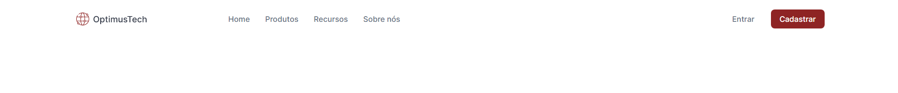
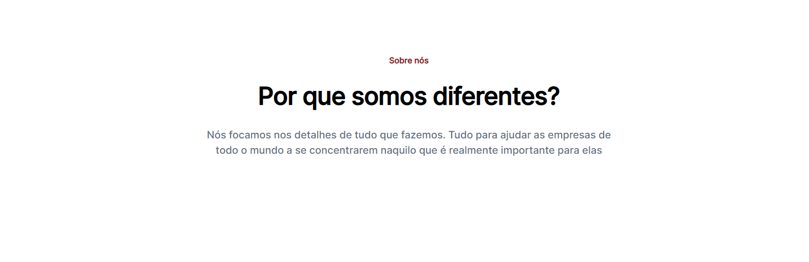
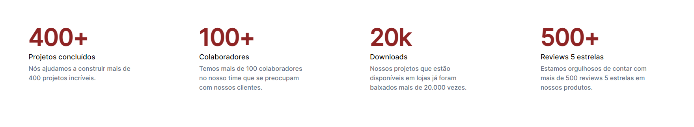
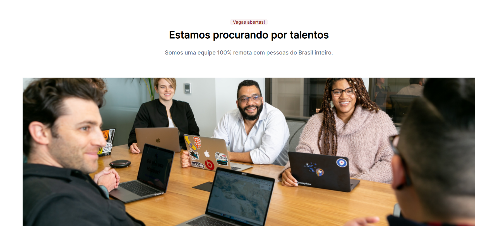
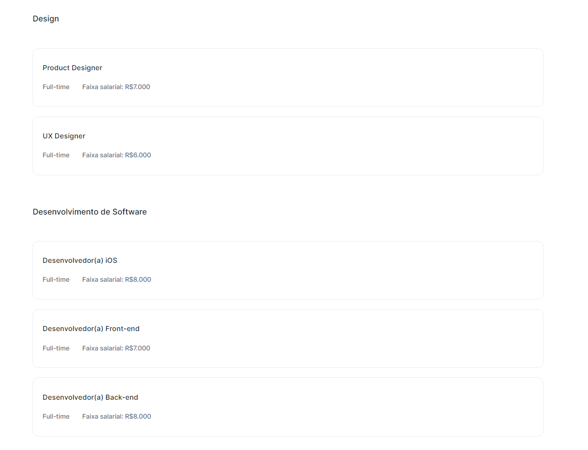
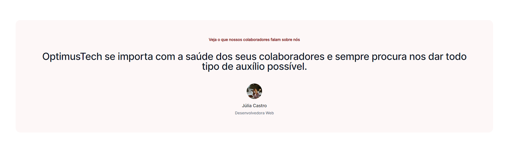
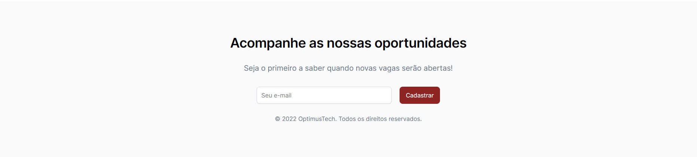

# 7DaysCodeHTMLCSS

Repository for the 7 days code challenge in HTML and CSS proposed by Giovanna Moeller from Girl Coding.

The challenge focus on developing a website based on the figma prototype. Each day we will have a different part of the project to develop.

Here is the roadmap:

Day 1: Navbar
 

 
Day 2: Header
 

 
Day 3: Metrics
 

 
Day 4: Jobs header
 

 
Day 5: Jobs opportunities
 

 
Day 6: Feedbacks
 

 
Day 7: Footer
 

#7DaysCodeHTMLCSS
